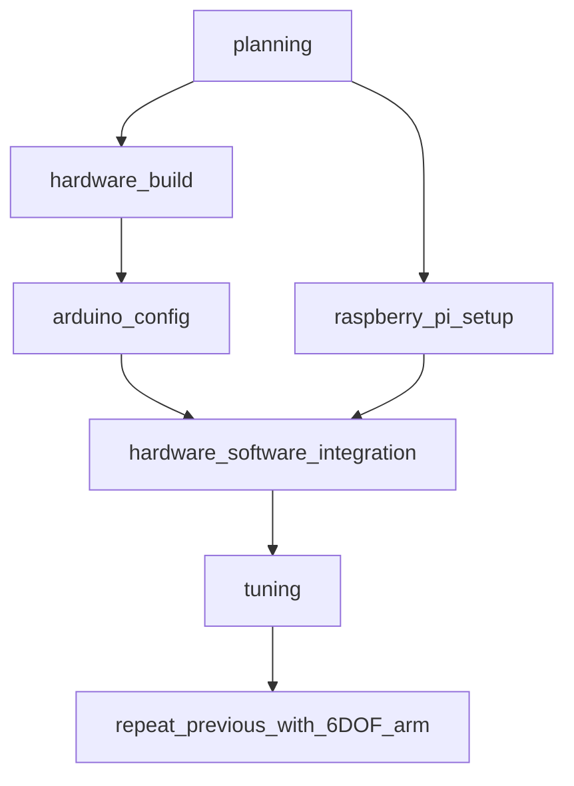

Wibble
This is a mini robot that I created

```mermaid
graph TD;
    planning --> hardware_build
    planning --> raspberry_pi_setup
    hardware_build --> arduino_config
    arduino_config --> hardware_software_integration
    raspberry_pi_setup --> hardware_software_integration
    hardware_software_integration --> tuning
    tuning --> repeat_previous_with_6DOF_arm
```
