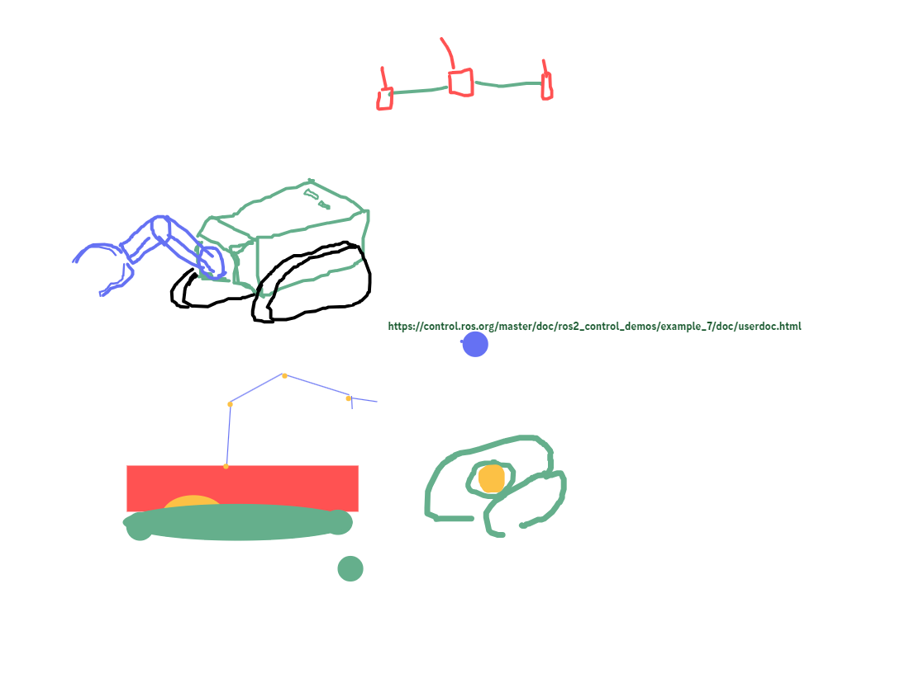

https://www.instructables.com/Build-Your-Own-Turtblebot-Robot/

List:
- Raspberry Pi (~$60)
- Arduino ($50)

Instructions:
1. foam tape around motors (1 foam tape; 2 motors)
2. printed parts
3. 65 mm minimum diameter wheel

Idea:
